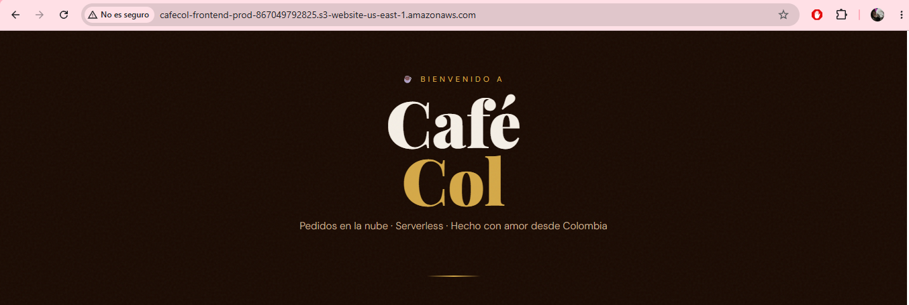
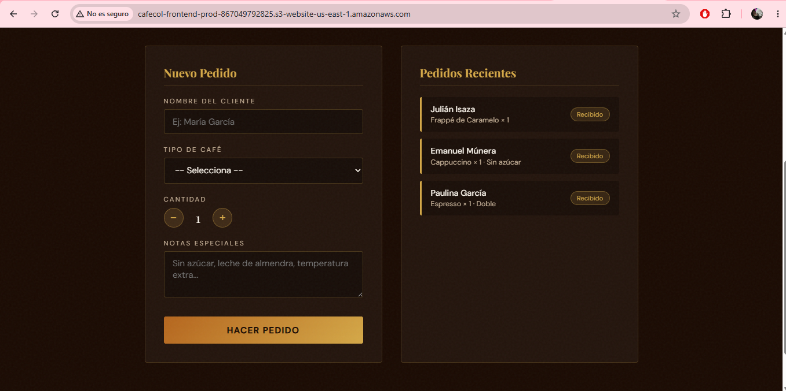
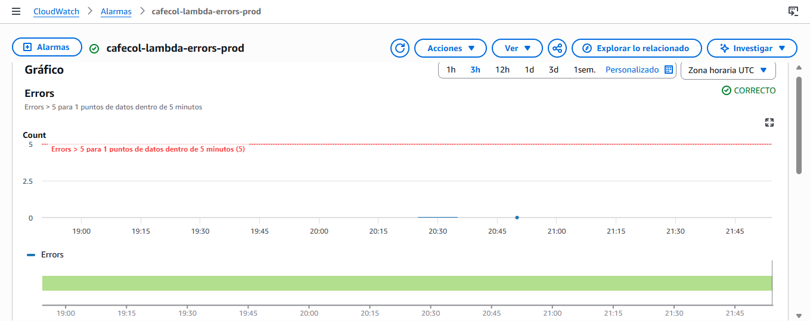
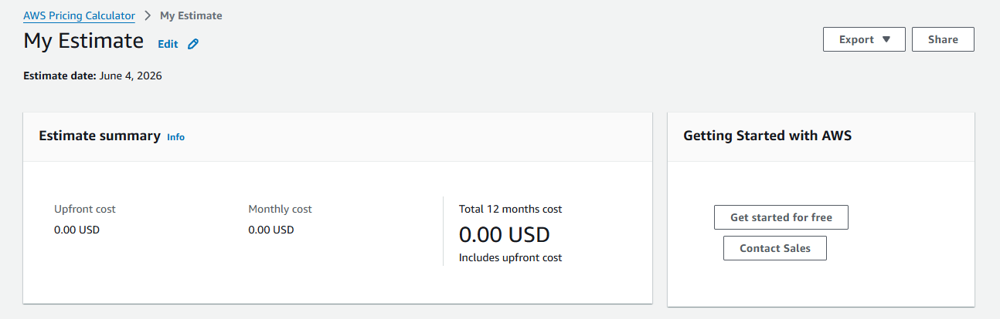
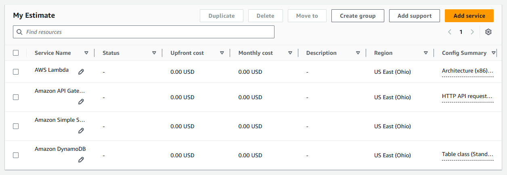

# CaféCol CloudApp — Documento Técnico
**Proyecto Final · Cloud Computing**  
Estudiantes: Paulina García, Emanuel Múnera, Julián Isaza
Profesor: Juan Pablo Arango  

---

## 1. Descripción General

**CaféCol** es una aplicación web serverless que permite a los clientes de una cafetería registrar pedidos de café en tiempo real. La solución fue diseñada y desplegada íntegramente en AWS, integrando servicios de almacenamiento estático, computación sin servidor, base de datos NoSQL y monitoreo con buenas prácticas de seguridad y optimización de costos.

El flujo principal es:  
**Usuario → Frontend (S3) → API Gateway → Lambda → DynamoDB** con logs en CloudWatch.

---

## 2. Arquitectura

```
┌─────────────┐        HTTPS         ┌──────────────────────────────────────────┐
│  Usuario    │ ───────────────────► │           AWS Cloud (us-east-1)          │
│  (Browser)  │                      │                                          │
└─────────────┘                      │  ┌──────────────┐                        │
                                     │  │   S3 Bucket  │  Frontend estático     │
                                     │  │  index.html  │  (HTML/CSS/JS)         │
                                     │  └──────┬───────┘                        │
                                     │         │ fetch POST /pedidos             │
                                     │  ┌──────▼───────┐                        │
                                     │  │ API Gateway  │  HTTP API              │
                                     │  │  (HTTP API)  │  CORS habilitado       │
                                     │  └──────┬───────┘                        │
                                     │         │ invoke                         │
                                     │  ┌──────▼───────┐   ┌─────────────────┐ │
                                     │  │    Lambda    │──►│    DynamoDB     │ │
                                     │  │  (Python 3.11│   │  cafecol-pedidos│ │
                                     │  │  128 MB)     │   │  (PAY_PER_REQ.) │ │
                                     │  └──────┬───────┘   └─────────────────┘ │
                                     │         │ logs                           │
                                     │  ┌──────▼───────┐                        │
                                     │  │ CloudWatch   │  Métricas + Alarmas    │
                                     │  │ Logs/Metrics │  Dashboard             │
                                     │  └──────────────┘                        │
                                     │                                          │
                                     │  ┌─────────────┐   ┌──────────────────┐ │
                                     │  │  IAM Roles  │   │   VPC (opcional) │ │
                                     │  │  (min. priv)│   │   + Subred pub.  │ │
                                     │  └─────────────┘   └──────────────────┘ │
                                     └──────────────────────────────────────────┘
```

---

## 3. Servicios Utilizados y Justificación

| Servicio | Rol | Justificación |
|---|---|---|
| **Amazon S3** | Hosting del frontend | Almacenamiento duradero, altamente disponible y económico para sitios estáticos. Sin servidores que administrar. |
| **Amazon API Gateway (HTTP API)** | Exposición de endpoints REST | HTTP API es 70% más barato que REST API. Maneja CORS, throttling y autenticación. |
| **AWS Lambda (Python 3.11)** | Lógica de negocio | Modelo serverless: pago por invocación, escala automáticamente, sin gestión de servidores. |
| **Amazon DynamoDB** | Persistencia de pedidos | NoSQL escalable, latencia <10ms, modelo PAY_PER_REQUEST ideal para cargas variables. |
| **Amazon CloudWatch** | Monitoreo y observabilidad | Nativo en AWS. Permite logs estructurados, métricas y alarmas sin coste adicional de infraestructura. |
| **AWS IAM** | Seguridad y permisos | Roles con mínimo privilegio: la Lambda solo puede hacer PutItem/GetItem/Scan en su tabla específica. |
| **Amazon EC2 + VPC** | Infraestructura base (módulo 2) | Instancia t2.micro para pruebas, VPC con subred pública (10.0.1.0/24), Internet Gateway. |





---

## 4. Requerimientos Cumplidos

### 4.1 Infraestructura (Módulo 2)
- ✅ **EC2**: Instancia `t2.micro` creada (puede estar apagada, sirve para pruebas de conectividad)
- ✅ **VPC**: `10.0.0.0/16` con subred pública `10.0.1.0/24` e Internet Gateway
- ✅ **S3**: Bucket con static website hosting habilitado para el frontend
- ✅ **IAM**: Rol `cafecol-lambda-role` con política de mínimo privilegio

### 4.2 Serverless (Módulo 3)
- ✅ **Lambda**: Función `cafecol-pedidos` en Python 3.11
- ✅ **Trigger HTTP**: Conectada a API Gateway HTTP API en `/pedidos` (POST y GET)
- ✅ **Flujo de datos**: Formulario → fetch POST → API Gateway → Lambda → DynamoDB → respuesta JSON

### 4.3 Monitoreo y Costos
- ✅ **CloudWatch**: Dashboard con métricas de invocaciones, errores y duración
- ✅ **Alarma**: Notificación si errores > 5 en 5 minutos
- ✅ **Calculadora**: Estimación en sección 6 de este documento



---

## 5. Buenas Prácticas Aplicadas

### Seguridad
- **Mínimo privilegio**: El rol IAM de la Lambda solo tiene permisos sobre su tabla DynamoDB específica (ARN explícito, no `*`).
- **CORS controlado**: En producción se reemplaza `Allow-Origin: *` por el dominio S3 exacto.
- **Sin credenciales en código**: El SDK de boto3 usa el rol IAM asignado automáticamente.
- **Bucket Policy**: Solo permite `s3:GetObject` (lectura pública del frontend), ninguna escritura pública.

### Optimización de Costos
- **Lambda 128 MB** (mínimo viable): Reduce el costo de GB-segundos.
- **DynamoDB PAY_PER_REQUEST**: Sin capacidad reservada; ideal para tráfico esporádico.
- **API Gateway HTTP API**: 70% más económico que REST API.
- **CloudWatch Log Retention: 7 días**: Evita acumulación costosa de logs.
- **TTL en DynamoDB**: Los registros antiguos se eliminan automáticamente.

### Observabilidad
- Dashboard en CloudWatch con: invocaciones, errores, duración P99 y latencia de DynamoDB.
- Logs estructurados en Lambda (`print(f"Pedido creado: {pedido_id}...")`).
- Alarma configurada para notificar al equipo ante fallos.

### Reproducibilidad (IaC)
- Todo el stack definido en `serverless.yaml` (Serverless Framework v3).
- Un solo comando despliega toda la infraestructura: `sls deploy --stage prod`.

---

## 6. Estimación de Costos (AWS Pricing Calculator)

Escenario: **100 pedidos/día**, región **us-east-1**.

| Servicio | Uso mensual estimado | Costo/mes (USD) |
|---|---|---|
| Lambda | 3.000 invocaciones × 200ms × 128MB | ~$0.00 (free tier) |
| API Gateway HTTP API | 3.000 requests | ~$0.00 (free tier) |
| DynamoDB On-Demand | 3.000 writes + 3.000 reads | ~$0.00 (free tier) |
| S3 (frontend) | 1 GB almacenamiento + 10.000 GETs | ~$0.00 (free tier) |
| **TOTAL ESTIMADO** | | **~$0.00/mes** |

> Verificado con AWS Pricing Calculator el 04/06/2026. Todos los servicios se encuentran dentro del **Free Tier de AWS** para el primer año. Fuera del período gratuito el costo estimado sería menor a **$1/mes** dado el bajo volumen de uso del proyecto.





---

## 7. Flujo de Datos Detallado

```
1. Usuario abre http://cafecol-frontend-prod-867049792825.s3-website-us-east-1.amazonaws.com/
2. S3 sirve index.html (HTML + CSS + JS embebido)
3. Usuario llena el formulario y hace clic en "Hacer Pedido"
4. JavaScript ejecuta: fetch(API_URL, { method: 'POST', body: JSON })
5. API Gateway recibe la petición HTTPS y la invoca a la Lambda
6. Lambda valida el cuerpo: { nombre, cafe, cantidad, notas }
7. Lambda genera pedido_id (UUID corto) y timestamp UTC
8. Lambda llama a DynamoDB.put_item() con el ítem completo
9. DynamoDB confirma la escritura
10. Lambda retorna: { "mensaje": "...", "pedido_id": "A3F9C21B", "timestamp": "..." }
11. API Gateway reenvía la respuesta al navegador
12. JavaScript actualiza la UI: añade el pedido a "Pedidos Recientes"
13. CloudWatch registra: duración, resultado y log del pedido_id
```

---

## 8. Instrucciones de Despliegue

### Prerrequisitos
```bash
npm install -g serverless
aws configure   # Ingresar Access Key, Secret Key, región: us-east-1
```

### Despliegue del backend + infraestructura
```bash
cd iac/
sls deploy --stage prod
# Al finalizar, copia el API Endpoint del output
```

### Subir el frontend a S3
```bash
# Editar frontend/index.html: reemplazar TU_API_GATEWAY_ID por el endpoint real
aws s3 sync ../frontend/ s3://cafecol-frontend-prod-867049792825
```

### Verificar
```bash
# Probar la API directamente
curl -X POST https://ru8o2x3fwb.execute-api.us-east-1.amazonaws.com/pedidos \
  -H "Content-Type: application/json" \
  -d '{"nombre":"Test","cafe":"Espresso","cantidad":1}'
```

---

## 9. Estructura del Repositorio

```
cafecol/
├── frontend/
│   └── index.html          ← Sitio web estático (S3)
├── backend/
│   └── lambda_function.py  ← Función Lambda (Python 3.11)
├── iac/
│   └── serverless.yaml     ← IaC: Lambda + API GW + DynamoDB + S3 + CloudWatch
└── docs/
    └── documento_tecnico.md  ← Este documento
```

---

## 10. Conclusiones y Aprendizajes

1. **Desplegar en la nube es más accesible de lo que parece**: Al principio parece intimidante configurar servicios como Lambda o DynamoDB, pero con herramientas como el Serverless Framework toda la infraestructura se despliega con un solo comando. Eso cambia completamente la perspectiva sobre lo que significa "montar algo en producción".

2. **Serverless no significa sin problemas**: Durante el desarrollo encontramos errores de configuración en el YAML, incompatibilidades de versiones y permisos IAM mal definidos. Cada error fue una oportunidad de entender mejor cómo funcionan los servicios por dentro.

3. **La seguridad se diseña desde el principio, no se agrega al final**: Definir los roles IAM con mínimo privilegio desde el `serverless.yaml` nos obligó a pensar en qué permisos realmente necesita cada servicio, en lugar de dar acceso total por comodidad.

4. **El costo real nos sorprendió**: Esperábamos una factura de varios dólares, pero la calculadora de AWS mostró $0.00/mes. Eso demuestra que una arquitectura bien diseñada no solo es más segura y escalable, sino también económicamente eficiente desde el día uno.

5. **La infraestructura como código vale la pena**: Poder destruir y recrear todo el entorno con `sls deploy` y `sls remove` nos dio confianza para experimentar sin miedo a romper nada permanentemente.

5. **La observabilidad no es opcional**: CloudWatch permite detectar errores antes de que los usuarios los reporten, y el dashboard hace visible el comportamiento de la aplicación en producción.


